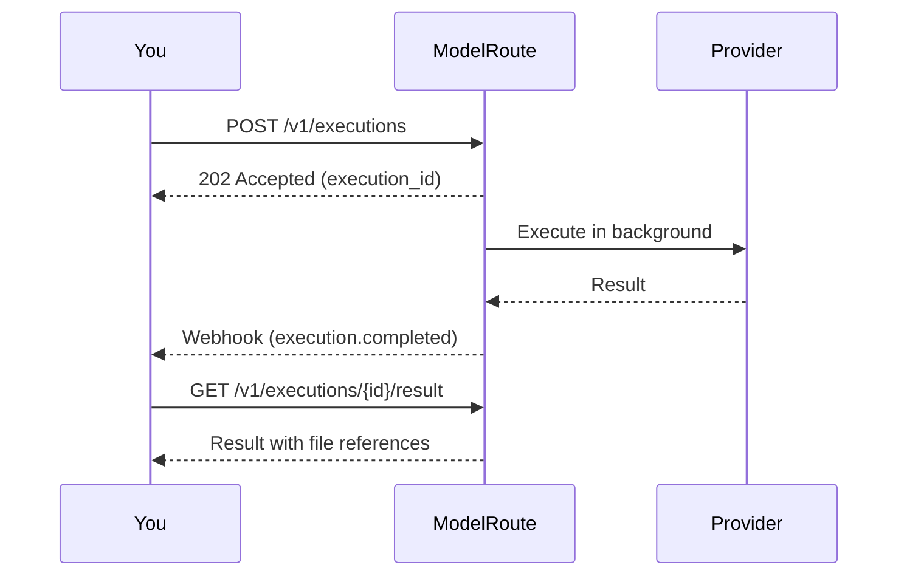

## Async-first by design

Every ModelRoute execution is **asynchronous**. When you submit a request, you immediately receive a `202 Accepted` response with an execution ID. The actual AI processing happens in the background.

This is an intentional design decision, not a limitation:

- **Resilience** — your request is durably tracked even if a provider takes minutes to respond
- **Scalability** — no HTTP connections held open during long-running generations
- **Reliability** — automatic retries, failover, and timeout handling happen behind the scenes
- **Consistency** — one integration pattern works for every model, from sub-second text to minutes-long video

<Info>
We don't expose synchronous endpoints. Many AI operations (video generation, image editing, complex reasoning) take 10 seconds to 5 minutes. Holding HTTP connections open for that long is fragile and doesn't scale. The async pattern gives you a robust integration from day one.
</Info>

## The execution flow

## Execution states

| Status | What's happening |
|-|-|
| `PENDING` | Request received, balance hold placed. Queued for provider dispatch. |
| `PROCESSING` | Dispatched to provider. Execution in progress. |
| `AWAITING_WEBHOOK` | Sent to provider. Waiting for provider to call back with results. |
| `COMPLETED` | Done. Result available for download. |
| `FAILED` | Failed. Normalized error code tells you exactly what went wrong. |
| `CANCELLED` | Cancelled by you. Balance hold released. |
| `EXPIRED` | Timed out. Balance hold released. |

Once an execution reaches a terminal state (`COMPLETED`, `FAILED`, `CANCELLED`, `EXPIRED`), it never changes again.

## Getting results: webhook vs polling

You have two options for receiving results:

| Method | Best for | How |
|-|-|-|
| **Webhooks** (recommended) | Production applications | Register a webhook endpoint, receive `execution.completed` events automatically |
| **Polling** | Testing, prototyping, small-scale apps | Call `GET /v1/executions/{id}` until `status` is terminal |

<Warning>
**Polling is rate-limited.** It works well for testing and validating your idea quickly, but for production workloads at scale, webhooks are the way to go. Webhooks give you instant delivery with zero wasted API calls.
</Warning>

## Cost and balance holds

Before dispatching to a provider, ModelRoute:

1. **Estimates the cost** based on the model's pricing
2. **Places a balance hold** (estimate × 1.2 margin buffer, minimum $0.01)
3. On success → settles the hold to actual cost
4. On failure → releases the hold entirely (you're not charged)

## Idempotency

Every execution requires an `idempotency_key`. If you submit the same key twice, you get the original result back — no duplicate charges, no duplicate processing.

Use deterministic, business-meaningful keys like `order-{id}-step-{n}` rather than random UUIDs.
