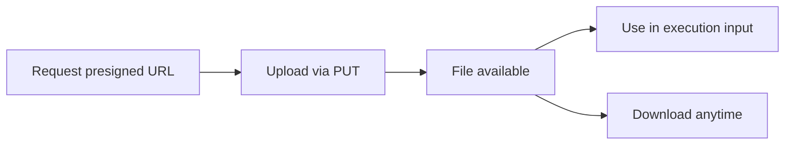

## Why files?

ModelRoute acts as a secure intermediary between you and AI providers. When you upload a file:

1. **Your file stays on ModelRoute** — providers never receive your original file URL or storage credentials
2. **ModelRoute transfers the file** to the provider using provider-specific mechanisms
3. **Output files are stored on ModelRoute** — you download them via ModelRoute, not from the provider

This design ensures provider isolation. Switching providers or adding new ones never requires changes to your file handling code.

## File references

Every uploaded file gets a unique reference in the format:

```
file_<uuid>
```

Example: `file_f47ac10b-58cc-4372-a567-0e02b2c3d479`

Use file references in execution inputs (e.g., an image to transform) and read them from execution outputs (e.g., a generated image).

## Limits

| Limit | Value |
|-|-|
| Maximum file size | 100 MB |
| Supported upload method | Presigned URL (PUT) |
| File retention | Files are retained for the lifetime of your organization |
| File access | Scoped to your organization — no cross-org access |

## File lifecycle



1. **Request a presigned upload URL** — `POST /v1/files/upload`
2. **Upload via HTTP PUT** to the presigned URL
3. **Use the file reference** in execution inputs
4. **Download results** — execution outputs contain file references you can download

## Next steps

<CardGroup cols={3}>
  <Card title="Uploading Files" icon="upload" href="/files/uploading">
    Step-by-step guide to uploading files.
  </Card>
  <Card title="Downloading Files" icon="download" href="/files/downloading">
    How to download execution results.
  </Card>
  <Card title="Storage Pricing" icon="dollar-sign" href="/files/pricing">
    $0.05/GB/month. Uploads, downloads, and egress are free.
  </Card>
</CardGroup>
